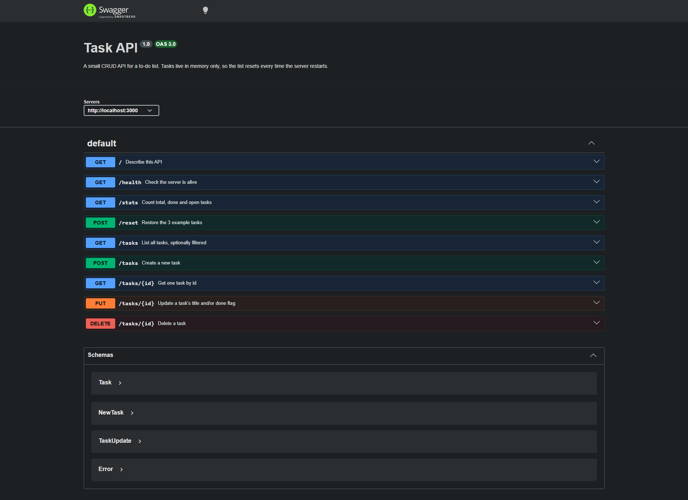

# Task API

A small CRUD API for managing a to-do list, built with **Node.js + Express**.
FlyRank Internship · Backend Track · Week 2 · Assignment A1.

Tasks are stored **in memory only** — there is no database and no file storage,
so the list resets to its 3 example tasks every time the server restarts.

## Install & run

You need [Node.js](https://nodejs.org) 18 or newer.

```bash
npm install
npm start
```

The server starts on **http://localhost:3000**.
Interactive Swagger docs: **http://localhost:3000/docs**

## Endpoints

| Method | Path         | What it does                     | Status codes            |
| ------ | ------------ | -------------------------------- | ----------------------- |
| GET    | `/`          | Describes this API               | 200                     |
| GET    | `/health`    | Says the server is alive         | 200                     |
| GET    | `/tasks`     | Lists all tasks                  | 200, 400 (bad `done`)   |
| GET    | `/tasks/:id` | Gets one task                    | 200, 404                |
| POST   | `/tasks`     | Creates a task from `{ "title" }`| 201, 400                |
| PUT    | `/tasks/:id` | Updates `title` and/or `done`    | 200, 400, 404           |
| DELETE | `/tasks/:id` | Deletes a task (empty body)      | 204, 404                |
| GET    | `/stats`     | Counts total / done / open       | 200                     |
| POST   | `/reset`     | Restores the 3 example tasks     | 200                     |

A task looks like this:

```json
{ "id": 1, "title": "Buy milk", "done": false }
```

Every error response is JSON with an `error` field, for example
`{ "error": "Task 99 not found" }`.

### Validation rules

- `POST /tasks` — `title` must be present and a non-empty string, otherwise **400**.
- `PUT /tasks/:id` — the body must contain `title` and/or `done`; `title` must be a
  non-empty string and `done` must be a boolean, otherwise **400**.

### Query parameters (optional extras)

| Example                      | What you get                       |
| ---------------------------- | ---------------------------------- |
| `GET /tasks?done=true`       | Only finished tasks                |
| `GET /tasks?search=milk`     | Tasks whose title contains "milk"  |
| `GET /tasks?done=false&search=api` | Both filters combined        |

## Example: creating a task with curl

```
$ curl -i -X POST http://localhost:3000/tasks -H "Content-Type: application/json" -d '{"title":"Buy milk"}'

HTTP/1.1 201 Created
X-Powered-By: Express
Content-Type: application/json; charset=utf-8
Content-Length: 40
ETag: W/"28-PpSBYV7i68cXyGc7AhjVpkZkY5Q"
Date: Mon, 20 Jul 2026 15:45:12 GMT
Connection: keep-alive
Keep-Alive: timeout=5

{"id":4,"title":"Buy milk","done":false}
```

## The full CRUD cycle with curl

```bash
curl -i -X POST http://localhost:3000/tasks -H "Content-Type: application/json" -d '{"title":"Buy milk"}'   # 201
curl -i http://localhost:3000/tasks/4                                                                        # 200
curl -i -X PUT http://localhost:3000/tasks/4 -H "Content-Type: application/json" -d '{"done":true}'          # 200
curl -i -X DELETE http://localhost:3000/tasks/4                                                              # 204
curl -i http://localhost:3000/tasks/4                                                                        # 404
```

## Swagger UI

All endpoints are listed at http://localhost:3000/docs, and the full CRUD cycle
works there through the **Try it out** button.



## The mortality experiment

I created a fourth task called "Will I survive a restart?", confirmed it in
`GET /tasks`, then stopped and restarted the server — and it was gone, with the
list back to the original three tasks.

That happened because the tasks live in a plain JavaScript array inside the
running process, so when the process ends the array ends with it. A database
would keep the data on disk, outside the program's lifetime — which is exactly
what next week is about.
